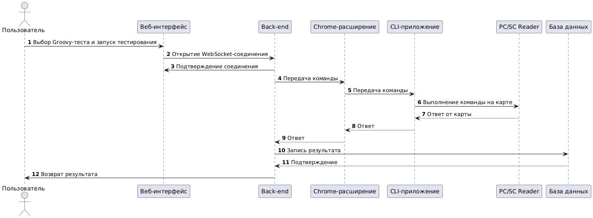
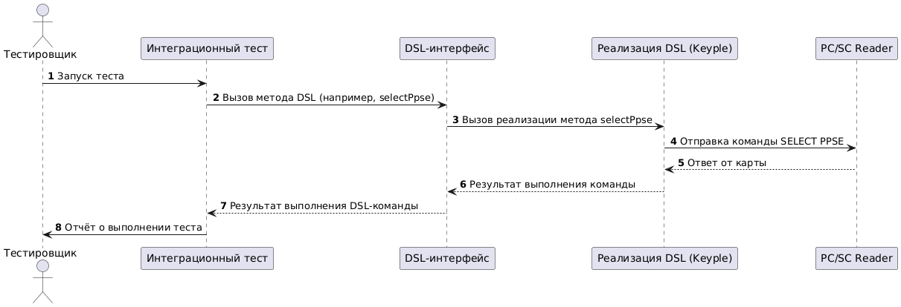
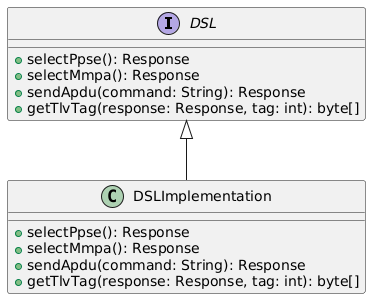
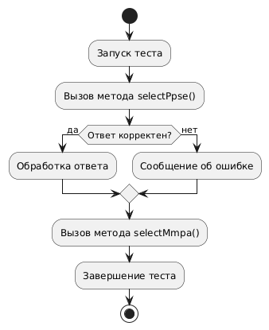
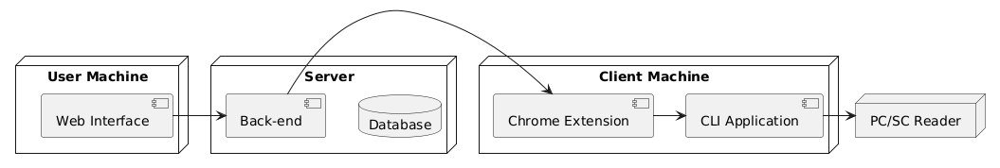

**Тема проектной работы:**
Разработка DSL (Domain-Specific Language) для упрощения тестирования взаимодействия с PC/SC-ридером.

**Описание текущего рабочего процесса:**



1. Пользователь в веб-интерфейсе выбирает Groovy-тест, который необходимо выполнить.
2. Пользователь нажимает кнопку «Начать тестирование», и приложение открывает соединение с back-end по WebSocket.
3. Back-end начинает исполнение выбранного Groovy-теста.
4. Во время исполнения Groovy-теста команды передаются через WebSocket на front-end приложение (веб-интерфейс).
5. Веб-интерфейс:
   - Обрабатывает команды, выполняя необходимую бизнес-логику (например, отображение уведомлений).
   - Перенаправляет команды в Chrome-расширение.
6. Chrome-расширение передаёт команды в CLI (Windows-приложение).
7. CLI отправляет команды в PC/SC Reader для выполнения операции с платёжной картой.
8. Ответ от PC/SC Reader возвращается по цепочке:
   - CLI → Chrome-расширение → front-end приложение → back-end приложение.
9. Back-end приложение получает ответ, записывает его в базу данных и завершает исполнение теста.

**Цель проекта:**
Создать DSL на Groovy для упрощения написания тестовых сценариев. DSL должен оборачивать низкоуровневые команды в удобный и читаемый синтаксис, сохраняя полную функциональность текущего тестирования.

**MVP проекта:**




1. Разработка минимально работоспособного DSL:

   - Создать синтаксис для описания тестов.
   - Определить интерфейсы для ключевых методов DSL (например, selectPpse, sendApdu, getTlvTag), чтобы обеспечить возможность замены реализации.
   - Реализацию интерфейсов в рамках MVP выполнить с использованием библиотеки Keyple Plugin PC/SC Library.

2. Написание интеграционных тестов:

   - Проверить корректность работы DSL.
   - Реализовать сценарии:
      - Проверка баланса карты.
      - Выполнение транзакции.
      - Обработка ошибок (например, если карта не читается).

3. Интеграция библиотеки для взаимодействия с PC/SC Reader:

   - Использовать библиотеку **Keyple Plugin PC/SC Library** для отправки команд и получения результатов.

4. Проверка работы MVP:

   - Демонстрация сценариев, описанных в интеграционных тестах.
   - Валидация правильности работы DSL через тесты.

**Функциональные требования:**

1. DSL должен позволять:

   - Описывать сценарии тестирования с использованием декларативного синтаксиса.
   - Взаимодействовать с PC/SC Reader через библиотеку.
   - Генерировать команды для выполнения операций с картами.

2. Интеграционные тесты должны:

   - Проверять корректность работы DSL.
   - Поддерживать сценарии успешных операций и обработку ошибок.

**Нефункциональные требования:**



1. Код DSL должен быть:

   - Читаемым и интуитивно понятным для новых членов команды.
   - Лёгким для расширения (добавления новых команд).

2. Тесты должны быть:

   - Автономными, чтобы запускаться без вмешательства пользователя.
   - Быстро выполняемыми, чтобы не задерживать процесс разработки.

3. DSL и тесты должны быть совместимы с существующей инфраструктурой.

**Набор библиотек и технологий:**

1. **Язык программирования:** Groovy — для реализации DSL и написания тестов.
2. **Фреймворк:** Spock — для написания и выполнения интеграционных тестов.
3. **Библиотека для взаимодействия с PC/SC-ридером:** Keyple Plugin PC/SC Library — для отправки команд и получения ответов от ридера.
4. **Сборщик проекта:** Gradle (Groovy DSL) — для управления зависимостями и сборкой проекта.
5. **Инструменты для отладки:** Logback или Slf4j — для логирования.

**API разрабатываемого решения:**



1. **Команда SELECT MMPA:**

   ```groovy
   selectMmpa()
   ```

   - Отправляет команду SELECT MMPA на карту и возвращает результат.

2. **Команда sendAPDU:**

   ```groovy
   sendApdu("00A404000E325041592E5359532E444446303100")
   ```

   - Отправляет APDU-команду на карту и возвращает результат.

3. **Добавление описания теста:**

   ```groovy
   describe("Test for checking mobile application version")
   ```

   - Добавляет описание для теста, чтобы уточнить его цель и контекст.

4. **Команда SELECT PPSE:**

   ```groovy
   selectPpse()
   ```

   - Отправляет команду SELECT PPSE на карту и возвращает результат.

5. **Проверка ответов:**

   ```groovy
   match(response, "*(9000)", "Response must be correct and SW = 9000")
   ```

   - Сравнивает ответ с ожидаемым значением и добавляет результат в отчёт.

6. **Работа с TLV-данными:**

   ```groovy
   getTlvTag(response, 0x9F7E)
   ```

   - Извлекает тег из TLV-ответа.

7. **Логика обработки данных:**

   - Поддержка сценариев обработки ответа карты, например:
     ```groovy
     byte[] applicationLifeCycleData = protocolUtils.getTКDataResult, 0x9F7E)
     String sdkVersion = new String(Arrays.copyOfRange(applicationLifeCycleData, 1, applicationLifeCycleData.length))
     ```

**Результат:**



- Рабочий DSL на Groovy, который позволяет декларативно описывать тестовые сценарии.
- Набор интеграционных тестов, демонстрирующих работу DSL.
- Код DSL готов к интеграции в основной проект.

